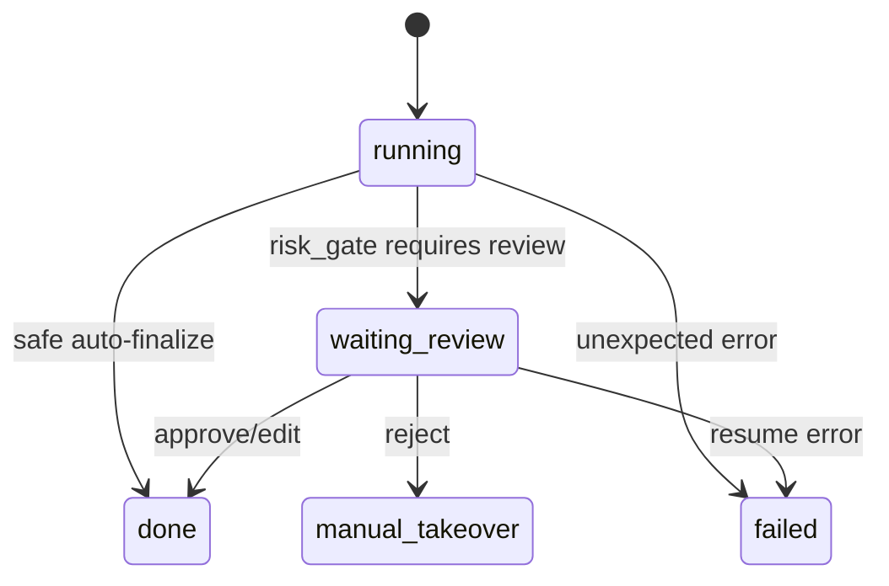

# Review and Risk Gate Design

## 1. Purpose

This document defines how `supportflow-agent` decides whether AI output can be finalized or must go through human review.

Human review is not a decorative feature. It is the safety boundary that makes the workflow more realistic than a prompt demo.

## 2. Design stance

### 2.1 Review after draft, not before retrieval

The review gate should run after:

```text
classification -> retrieval -> draft
```

Reason:

- reviewer needs to see the draft
- reviewer needs evidence/citations
- risk decision needs classification, retrieval, and draft confidence

### 2.2 Gate is deterministic in v1

The LLM should not be the sole judge of safety in v1.

The risk gate may consume model-produced fields, but final review decision should be rule-based and inspectable.

## 3. Risk gate inputs

```python
class RiskGateInput(BaseModel):
    classification: TicketClassification
    retrieved_chunks: list[KBHit]
    draft: DraftReply
    customer_tier: str
```

## 4. Risk gate output

```python
class RiskDecision(BaseModel):
    review_required: bool
    risk_flags: list[str]
    reason: str
```

## 5. Review trigger rules

### Must trigger review

| Rule                                                                      | Reason                   |
| ------------------------------------------------------------------------- | ------------------------ |
| `classification.priority in ["P0", "P1"]`                                 | high severity            |
| `draft.confidence < 0.75`                                                 | low confidence           |
| `retrieved_chunks` is empty                                               | no evidence              |
| `classification.category == "billing"` and `draft.confidence < 0.85`      | money-related            |
| `draft.risk_flags` contains sensitive flags                               | explicit model/node risk |
| ticket mentions refund, payment, account unlock, legal, outage, data loss | high business risk       |

### May auto-finalize

All conditions must hold:

```text
priority in P2/P3
retrieved_chunks not empty
draft.confidence >= 0.85
risk_flags empty
category not billing-sensitive
```

MVP note:

Even when auto-finalized, do not actually send external messages. Only mark as ready.

## 6. Risk flag taxonomy

```text
no_evidence
low_confidence
billing_sensitive
account_security
outage_or_bug
enterprise_customer
policy_gap
unsupported_claim
```

## 7. Interrupt payload

When review is required, the graph should interrupt with a JSON-serializable payload:

```json
{
  "type": "human_review_required",
  "ticket_id": "T-1001",
  "thread_id": "ticket:T-1001:active",
  "classification": {
    "category": "billing",
    "priority": "P2",
    "summary": "用户询问退款未到账",
    "confidence": 0.86
  },
  "draft": {
    "answer": "您好，退款通常会在 1-3 个工作日内处理完成...",
    "citations": ["refund_policy#refund-timeline#0001"],
    "confidence": 0.72,
    "risk_flags": ["billing_sensitive"]
  },
  "evidence": [
    {
      "chunk_id": "refund_policy#refund-timeline#0001",
      "title": "Refund Policy",
      "snippet": "退款通常在 1-3 个工作日内处理..."
    }
  ],
  "risk_flags": ["billing_sensitive", "low_confidence"],
  "allowed_decisions": ["approve", "edit", "reject"]
}
```

Do not include:

- raw API keys
- complete prompt templates
- huge document bodies
- internal stack traces

## 8. Reviewer actions

### Approve

Meaning:

- reviewer accepts original draft
- final answer = draft answer

State update:

```json
{
  "decision": "approve",
  "reviewer_note": "证据充分，可以回复"
}
```

### Edit

Meaning:

- reviewer modifies AI draft
- final answer = edited answer

State update:

```json
{
  "decision": "edit",
  "edited_answer": "您好，我们已收到您的退款问题...",
  "reviewer_note": "弱化到账承诺"
}
```

Validation:

- `edited_answer` is required.
- final citations can preserve draft citations if still relevant.

### Reject

Meaning:

- AI draft should not be used
- ticket requires manual takeover

State update:

```json
{
  "decision": "reject",
  "reviewer_note": "知识库无相关政策，需人工确认"
}
```

## 9. Resume behavior

Resume endpoint:

```http
POST /api/v1/runs/{thread_id}/resume
```

Graph behavior:

```text
human_review_interrupt
-> apply_review_decision
-> conditional:
   - approve/edit -> finalize_reply
   - reject -> manual_takeover
```

## 10. State transitions



## 11. API contracts

```python
class PendingReviewItem(BaseModel):
    review_id: str
    ticket_id: str
    thread_id: str
    classification: TicketClassification
    draft: DraftReply
    evidence: list[KBHit]
    risk_flags: list[str]
    created_at: str

class SubmitReviewDecisionRequest(BaseModel):
    decision: Literal["approve", "edit", "reject"]
    reviewer_note: str | None = None
    edited_answer: str | None = None
```

## 12. Frontend requirements

Review queue page must show:

- ticket title/content
- category and priority
- draft answer
- citations/evidence
- risk flags
- confidence
- approve/edit/reject controls

Reviewer should not need to inspect raw JSON for normal use. Raw state can be optional debug panel.

## 13. Failure handling

| Failure                          | Handling                           |
| -------------------------------- | ---------------------------------- |
| resume without pending interrupt | return 409 conflict                |
| edit without edited_answer       | return 422 validation error        |
| unknown decision                 | return 422 validation error        |
| interrupted thread missing       | return 404                         |
| stale review decision            | return 409 conflict                |
| graph resume fails               | keep review pending and show error |

## 14. What not to do in v1

Do not:

- require review for every ticket
- let the LLM decide alone whether review is needed
- auto-send external replies
- hide evidence from reviewer
- merge review status into generic run status
- build multi-level approval

## 15. Test cases

Minimum tests:

1. Low confidence triggers review.
2. No evidence triggers review.
3. Billing low-confidence triggers review.
4. Safe P3 ticket finalizes without review.
5. Approve resumes to final answer.
6. Edit resumes with edited answer.
7. Reject leads to manual takeover.

## 16. Update triggers

Update this document when:

- changing review triggers
- changing interrupt payload
- changing reviewer actions
- changing resume API
- changing review UI
- adding external side effects
