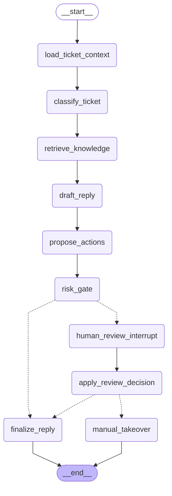

# Current LangGraph

Generated from `backend/app/graph/builder.py`.

```mermaid
---
config:
  flowchart:
    curve: linear
---
graph TD;
	__start__([<p>__start__</p>]):::first
	load_ticket_context(load_ticket_context)
	classify_ticket(classify_ticket)
	retrieve_knowledge(retrieve_knowledge)
	draft_reply(draft_reply)
	risk_gate(risk_gate)
	propose_actions(propose_actions)
	human_review_interrupt(human_review_interrupt)
	apply_review_decision(apply_review_decision)
	finalize_reply(finalize_reply)
	manual_takeover(manual_takeover)
	__end__([<p>__end__</p>]):::last
	__start__ --> load_ticket_context;
	apply_review_decision -.-> finalize_reply;
	apply_review_decision -.-> manual_takeover;
	classify_ticket --> retrieve_knowledge;
	draft_reply --> propose_actions;
	human_review_interrupt --> apply_review_decision;
	load_ticket_context --> classify_ticket;
	propose_actions --> risk_gate;
	retrieve_knowledge --> draft_reply;
	risk_gate -.-> finalize_reply;
	risk_gate -.-> human_review_interrupt;
	finalize_reply --> __end__;
	manual_takeover --> __end__;
	classDef default fill:#f2f0ff,line-height:1.2
	classDef first fill-opacity:0
	classDef last fill:#bfb6fc
```
