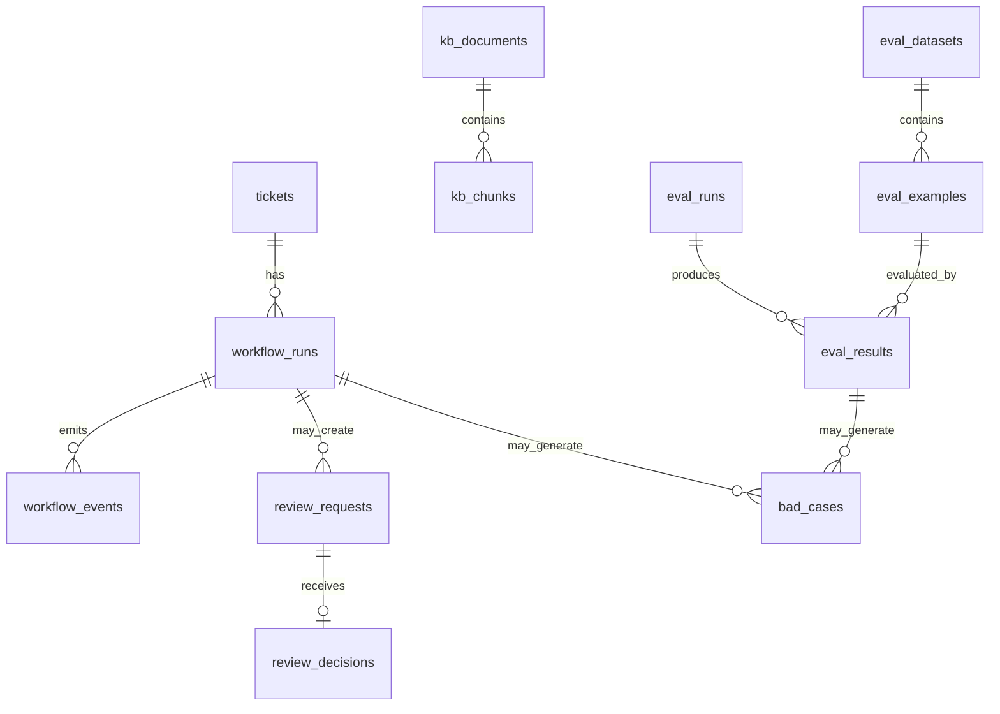

# Generated DB Schema

> This is a planned schema document for `supportflow-agent`.
> It is not generated from live migrations yet.
> Once Alembic or SQLModel migrations exist, this file should be regenerated from the actual database definitions.

## 1. Current DB stance

MVP starts with JSON files and in-memory graph checkpointing.

Database is introduced only when:

- review queue needs persistence
- run history must survive server restart
- eval and bad cases need durable records
- checkpointer moves beyond memory

Recommended path:

```text
Day1-Day2: JSON + InMemorySaver
Day3-Week1: SQLite for tickets/reviews/runs
Week2: Postgres optional
Stretch: pgvector optional
```

## 2. Entity relationship overview



## 3. Tables

## 3.1 `tickets`

Purpose:

Stores business support tickets.

```sql
CREATE TABLE tickets (
    id TEXT PRIMARY KEY,
    title TEXT NOT NULL,
    content TEXT NOT NULL,
    channel TEXT NOT NULL,
    customer_tier TEXT NOT NULL DEFAULT 'free',
    status TEXT NOT NULL DEFAULT 'new',
    category TEXT,
    priority TEXT,
    created_at TIMESTAMP NOT NULL DEFAULT CURRENT_TIMESTAMP,
    updated_at TIMESTAMP NOT NULL DEFAULT CURRENT_TIMESTAMP
);
```

Status values:

```text
new | running | waiting_review | done | manual_takeover | failed
```

## 3.2 `workflow_runs`

Purpose:

Stores each graph execution attempt.

```sql
CREATE TABLE workflow_runs (
    id TEXT PRIMARY KEY,
    ticket_id TEXT NOT NULL REFERENCES tickets(id),
    thread_id TEXT NOT NULL,
    graph_version TEXT NOT NULL,
    status TEXT NOT NULL,
    started_at TIMESTAMP NOT NULL DEFAULT CURRENT_TIMESTAMP,
    completed_at TIMESTAMP,
    final_answer TEXT,
    final_citations_json TEXT,
    error TEXT
);
```

Recommended indexes:

```sql
CREATE INDEX idx_workflow_runs_ticket_id ON workflow_runs(ticket_id);
CREATE INDEX idx_workflow_runs_thread_id ON workflow_runs(thread_id);
CREATE INDEX idx_workflow_runs_status ON workflow_runs(status);
```

## 3.3 `workflow_events`

Purpose:

Stores node-level timeline events for debugging and frontend display.

```sql
CREATE TABLE workflow_events (
    id TEXT PRIMARY KEY,
    run_id TEXT NOT NULL REFERENCES workflow_runs(id),
    node_name TEXT NOT NULL,
    event_type TEXT NOT NULL,
    payload_json TEXT,
    created_at TIMESTAMP NOT NULL DEFAULT CURRENT_TIMESTAMP
);
```

Event types:

```text
node_started | node_completed | interrupt | resumed | final_output | error
```

## 3.4 `review_requests`

Purpose:

Stores pending human review items.

```sql
CREATE TABLE review_requests (
    id TEXT PRIMARY KEY,
    run_id TEXT NOT NULL REFERENCES workflow_runs(id),
    ticket_id TEXT NOT NULL REFERENCES tickets(id),
    thread_id TEXT NOT NULL,
    status TEXT NOT NULL DEFAULT 'pending',
    risk_flags_json TEXT NOT NULL,
    interrupt_payload_json TEXT NOT NULL,
    created_at TIMESTAMP NOT NULL DEFAULT CURRENT_TIMESTAMP,
    resolved_at TIMESTAMP
);
```

Status values:

```text
pending | approved | edited | rejected | expired
```

## 3.5 `review_decisions`

Purpose:

Stores reviewer decisions.

```sql
CREATE TABLE review_decisions (
    id TEXT PRIMARY KEY,
    review_request_id TEXT NOT NULL REFERENCES review_requests(id),
    decision TEXT NOT NULL,
    reviewer_note TEXT,
    edited_answer TEXT,
    created_at TIMESTAMP NOT NULL DEFAULT CURRENT_TIMESTAMP
);
```

Decision values:

```text
approve | edit | reject
```

## 3.6 `kb_documents`

Purpose:

Stores knowledge documents.

```sql
CREATE TABLE kb_documents (
    id TEXT PRIMARY KEY,
    title TEXT NOT NULL,
    category TEXT NOT NULL,
    source_path TEXT NOT NULL,
    version TEXT,
    checksum TEXT,
    created_at TIMESTAMP NOT NULL DEFAULT CURRENT_TIMESTAMP,
    updated_at TIMESTAMP NOT NULL DEFAULT CURRENT_TIMESTAMP
);
```

## 3.7 `kb_chunks`

Purpose:

Stores chunks derived from KB documents.

```sql
CREATE TABLE kb_chunks (
    id TEXT PRIMARY KEY,
    doc_id TEXT NOT NULL REFERENCES kb_documents(id),
    chunk_index INTEGER NOT NULL,
    title TEXT NOT NULL,
    content TEXT NOT NULL,
    metadata_json TEXT,
    created_at TIMESTAMP NOT NULL DEFAULT CURRENT_TIMESTAMP
);
```

Recommended indexes:

```sql
CREATE INDEX idx_kb_chunks_doc_id ON kb_chunks(doc_id);
CREATE INDEX idx_kb_documents_category ON kb_documents(category);
```

If pgvector is introduced later:

```sql
-- Planned only.
-- ALTER TABLE kb_chunks ADD COLUMN embedding vector(1536);
-- CREATE INDEX idx_kb_chunks_embedding ON kb_chunks USING ivfflat (embedding vector_cosine_ops);
```

## 3.8 `eval_datasets`

Purpose:

Stores eval dataset metadata.

```sql
CREATE TABLE eval_datasets (
    id TEXT PRIMARY KEY,
    name TEXT NOT NULL UNIQUE,
    version TEXT NOT NULL,
    description TEXT,
    created_at TIMESTAMP NOT NULL DEFAULT CURRENT_TIMESTAMP
);
```

## 3.9 `eval_examples`

Purpose:

Stores eval examples.

```sql
CREATE TABLE eval_examples (
    id TEXT PRIMARY KEY,
    dataset_id TEXT NOT NULL REFERENCES eval_datasets(id),
    inputs_json TEXT NOT NULL,
    reference_outputs_json TEXT,
    metadata_json TEXT,
    created_at TIMESTAMP NOT NULL DEFAULT CURRENT_TIMESTAMP
);
```

## 3.10 `eval_runs`

Purpose:

Stores offline eval runs.

```sql
CREATE TABLE eval_runs (
    id TEXT PRIMARY KEY,
    dataset_id TEXT NOT NULL REFERENCES eval_datasets(id),
    target_name TEXT NOT NULL,
    graph_version TEXT,
    summary_json TEXT,
    started_at TIMESTAMP NOT NULL DEFAULT CURRENT_TIMESTAMP,
    completed_at TIMESTAMP
);
```

## 3.11 `eval_results`

Purpose:

Stores per-example eval result.

```sql
CREATE TABLE eval_results (
    id TEXT PRIMARY KEY,
    eval_run_id TEXT NOT NULL REFERENCES eval_runs(id),
    eval_example_id TEXT NOT NULL REFERENCES eval_examples(id),
    output_json TEXT NOT NULL,
    scores_json TEXT NOT NULL,
    passed BOOLEAN NOT NULL,
    trace_url TEXT,
    created_at TIMESTAMP NOT NULL DEFAULT CURRENT_TIMESTAMP
);
```

## 3.12 `bad_cases`

Purpose:

Stores failures worth investigating.

```sql
CREATE TABLE bad_cases (
    id TEXT PRIMARY KEY,
    source_type TEXT NOT NULL,
    source_id TEXT NOT NULL,
    failure_type TEXT NOT NULL,
    ticket_id TEXT,
    run_id TEXT,
    eval_result_id TEXT,
    notes TEXT,
    status TEXT NOT NULL DEFAULT 'open',
    created_at TIMESTAMP NOT NULL DEFAULT CURRENT_TIMESTAMP,
    resolved_at TIMESTAMP
);
```

Status values:

```text
open | fixed | wont_fix | duplicate
```

## 4. JSON fields

The v1 schema uses JSON-as-text for portability.

Examples:

- `risk_flags_json`
- `interrupt_payload_json`
- `metadata_json`
- `summary_json`
- `scores_json`

If using Postgres, these should become `JSONB`.

## 5. Checkpointer storage

LangGraph checkpoint tables are not defined here manually.

If using a LangGraph-provided persistent checkpointer, use its migration/setup mechanism rather than hand-writing tables.

This schema covers application-level entities, not internal checkpoint tables.

## 6. Migration plan

### Phase 0

No DB. Use JSON files.

### Phase 1

SQLite tables:

- tickets
- workflow_runs
- workflow_events
- review_requests
- review_decisions
- kb_documents
- kb_chunks

### Phase 2

Eval tables:

- eval_datasets
- eval_examples
- eval_runs
- eval_results
- bad_cases

### Phase 3

Postgres + optional pgvector.

## 7. Interview talking points

Strong answer:

> I did not start with a full database because the first priority was to validate the workflow. The planned schema separates business tickets, graph runs, review requests, KB chunks, and eval results, which maps directly to the system boundaries.

Weak answer:

> I added a database because every backend project should have one.

## 8. Update triggers

Update this document when:

- adding real ORM models
- adding migrations
- changing table names
- changing run/review persistence
- adding vector storage
- adding eval persistence
